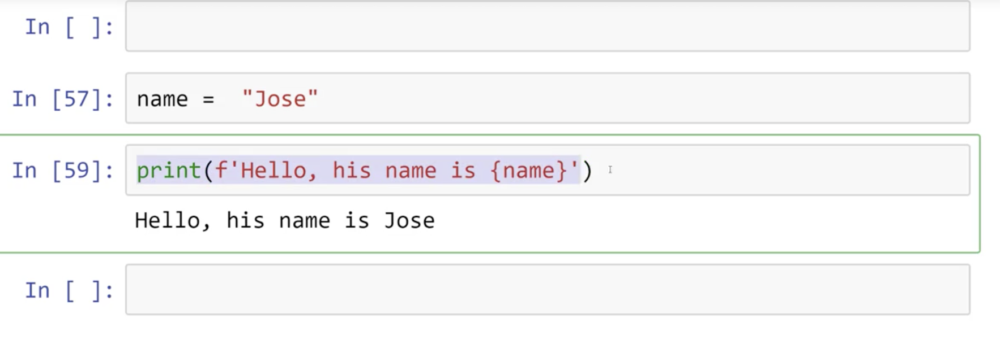
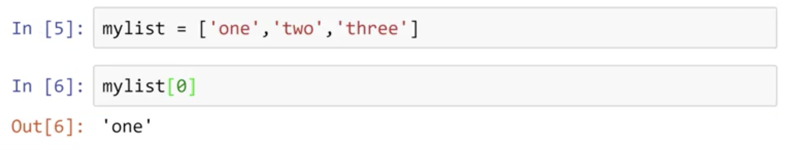
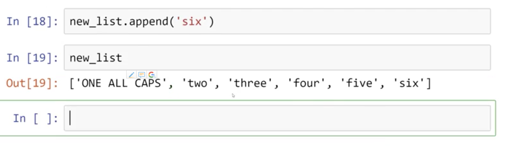
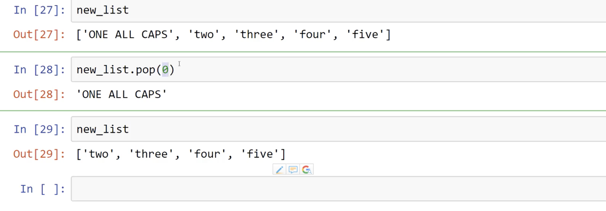
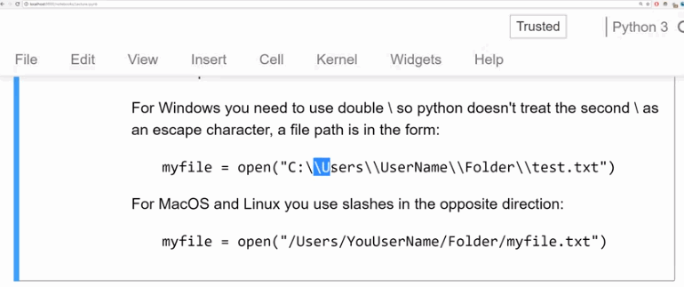
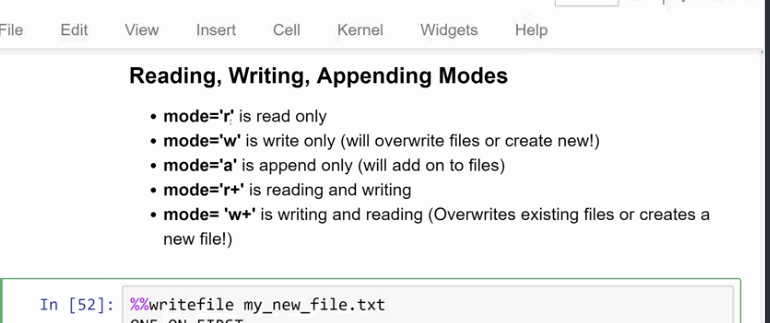

# Complete Python Bootcamp :Go from zero to hero in Python 3

## Menu

* Course Notes
    * 1. Course Overview
    * 2. Python setup
        * 5. Command line basics
            * Windows
                * use ``cd`` to go to folder 
                 * how to see the contents of that directory ? (windows : ``dir`` ,Mac os :``ls``)
                * go back :``cd ..``(works both on windows and Mac OS)
                * clean all :``cls`` (works on windows)
            * Mac OS or Linux
                * current directory: ``pwd``
                * files and folders in current directory `` ls ``
                * move to folder: ``cd``
                * clear screen: ``clear ``
                * go back preview folder:``cd ..``
        * 6. Installing Python
            * Advantages of Python
            * Anacoda Distribution
                * why ? 
                    * Anacoda including Python as well as many usefull libraries including Jupyter
                    * can be easily installed on any major os :Windows and Mac OS and Linux
                    * we also have Minicoda ,a smaller virsion of Anacoda
                * how ?
                    * [Anacoda download](http://anacoda.org/downloads)
                    * [how to install Anacoda](https://docs.anaconda.com/anaconda/install/mac-os#macos-graphical-install) 
                    * also we can download and install miniconda
                * Anaconda navigator
        * 7. Running Python Code
            * Run
                * Text editors
                * IDEs
                    * Pycharm
                    * Spyder
                * notebook environments
            * Jupyter (manage codes and files online)
        * 8. Getting the notebooks and course materials
            * Course note download:[Github](https://github.com/Pierian-Data/Complete-Python-3-Bootcamp)
        * 9. Git and Github Overview
    * 3. Python Object and Data Structure
        * 10. Introduction to Python data types
            * Data type
                * Integer :`int` 3,300 
                * Floating poin:`float` 2.3 ,4.6
                * strings:`str` "hello","summer" "2000"
                * Lists:`list` [10,"hello",2003.5]
                * Dictionaries:`dict`unordered key :value pains {"mykey":"value","name":"Yaakov"}
                * Tuples:`tup` (10,"hello",2003.5)
                * Sets:`set` {"a","b"}
                * Booleans:`bool` True or False 
        * 11. Numbers
            * integer
            * float
        * 13. Variable Assignments
            * Rules for Variable name: 
                * 1. cannot start with a number
                * 2. there can be no spaces in the name, use `_` instead
                * 3. can't use any of those symbols :``` """''',<>/?\|!@#$  %^&~-+```
                * 4. names are lower case
                * 5. Don't use some names that have special meaning on python 
        * 14. INtroduction to strings
            * slice: `[start:stop:step]`
            * new line `\n`
            * tab `\t`
            * string length `len()`
        * 15. Indexing and Slicing with string
            * indexsing : ```for mystring='Hello world' mystring[0]='H'```
            * `mystring[2:]`
            * `mystring[:3]` (upto but not including)
            * `mystring[3:5]`
            * `mystring[::]`
            * `mystring[::2]` (start:stop:step)
            * if mystring='abcdefghijk' then mystring[::-1]=`kjihgfedcba`
        * 16. String Properties and Methods
            * How do I create comments in my code? (You can use the hashtag # to create comments in your code)
            * Strings are immutable Strings are not mutable! (meaning you can't use indexing to change individual elements of a string)
            * '2'+'3'='23'
            * 2+3=5
            * X='Hello World' 
            * X.    (X. and the press tab in the ide we can have alot of methods there)
                * `X.upper() `
                * `X.lower()`
                *  `X.split()`
                *  `X.split(i)`
        * 17. Strings -FAQ
        * 18. Print Formatting with Strings
            * methods:
                * `.format()` .png) 2.png) _using_key_words.png) 
                * `f-string()`   
                * `.format()` for float formating _float1.png) _float2.png) 
        * 20. Lists in Python
            * operations:
                * `my_list=[1,2,3]` or `my_list = [123,'hello',34.2]` 
                * `len(my_list)`
                * 
                * lists can be added : `my_list + another_list` `new_list=my_list+another_list`
                * indexing works for list ` my_list[1]`
                *  `my_list.append('six')` :  
                *  removing items from the list ,we use `pup` mtehod : `new_list.pup(1)  
                *  `.sort()` method : `my_list.sort()` [1,3,5,7]
                *  `.reverse()`method  : `my_list.reverse()`   [7,5,3,1]
                *  FAQ:
                    *  Q:1. How do I index a nested list? For example if I want to grab 2 from [1,1,[1,2]]?
                    *  A:You would just add another set of brackets for indexing the nested list, for example: my_list[2][1] . We'll discover later on more nested objects and you will be quizzed on them later!
        * 22. Dixtionaries 
                * syntax: `{'key1':'value1','key2':'value2'}` 
                * hwne to choose dictionary and list ?
                    * dictionary : ` Obejects retrieved by key name`
                    * list:` Objects retrieved by location`
                    * calling value: ex:`my_dic = { 'key1':'value1','key2':'value2'} my_dic['key1']`
        * 24. Tuples with Python
            * differences with lists: 
                * lists: `mutable`
                * tuple: immutability ` one an element is inside a tuple ,it can not be reassigned` 
                * tuples use parenthesis 
                * tuple ` t=(1,2,3)` 
                * methods : 
                    * index `t.index()` 
                    * count `t.count()`
                * we use tuple no more than lists just in case we afraid to change resign the value incounciesly .
                * there are only two methods for tuples!
        * 25. Sets 
            * definition: ` sets are unordered collection of` **unique** `elements` .meaning there **onlyone** representative of the same object.
            * examples: ``` myset = set()```
            if I want to add some objects to the set ,use **add** method `myset.add(1)` . 
            * the elements in the sets are unique ,like we already have myset={1,2} ,after we want to add `myset.add(2)` dosent make sense because after this ,objects in the set are still {1,2} .
            * make list to the set : ` my-list=[1,1,1,1,2,2,2,2,3,3,3,3] ` and then ` set(my_list) = {1,2,3}` 
            * NOte: sets don't have an order !!!
        * 26. Booleans in Python
            * only **True** or **False** remember that the `True` and the `False` are both in capital word.
        * 27. I/O with Basic Files in Python
            * methods:
                * **open** : `myfile = open('myfile.txt')`
                * **read** : `myfile.read()`
                * **readlines** :`myfile.readlines()`
                * **close** : ``` myfile.open('test.txt') as my_new_file:
                    contents = my_new_file.read()```
            * Notes: 
                *  
                * Reading,Writing,Appending Modes:       
            * Errors:
                * FileNotFoundError :
                    1. wrong file name.
                    2. didn't provide the correct file path.
        * 29. Python Objects and Data Structures Assessment Test Overview
        * 30. Solutions for Python Objects and Data Structures Assessment Test Overview
    * 4. Python Comparison Operators
    * 5. Python Statements
    * 6. Methods and Functions
    * 7. Milestone Project -1
    * 8. Object Oriented Programming
    * 9. Modules and Packages
    * 10. Errors and Exceptions Handling
    * 11. Milestone Project -2
    * 12. Python Decorators
    * 13. Python Generators
    * 14. Python Final Capstone Python Project
    * 15. Advanced Python Modules
    * 16. Advanced Python Objects and Data Structures
    * 17. Bonus Material - Introduction to GUIs
    * 18. Bonus special offers
    * 19. Appendix:older python 2 material
* Resources
    * Nice Summary of the Differences:[The key differences between Python 2.7.x and Python 3.x with examples](http://sebastianraschka.com/Articles/2014_python_2_3_key_diff.html) 
    * Site that tells you which packages are Python 3 compatible:[Python 3 Readiness](http://py3readiness.org/)
    * Git Hello World Tutorial:[Hello World](https://guides.github.com/activities/hello-world/) 
    * 
* My Codes
